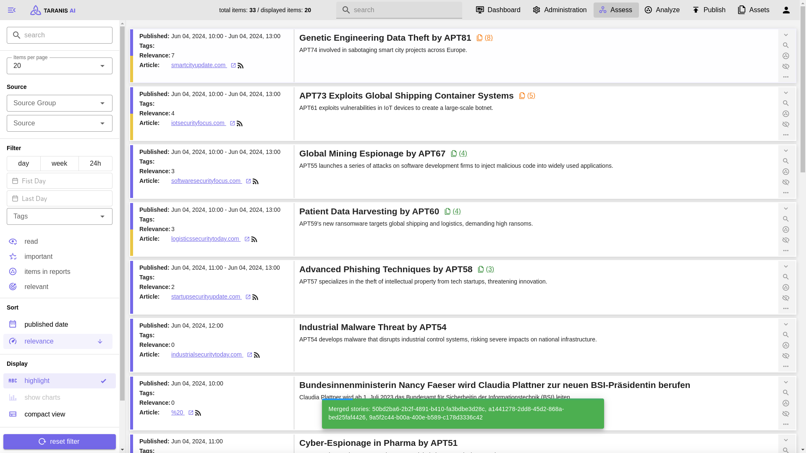

# Taranis AI

Taranis AI is an advanced Open-Source Intelligence (OSINT) tool, leveraging Artificial Intelligence to revolutionize information gathering and situational analysis.

Taranis navigates through diverse data sources like websites to collect unstructured news articles, utilizing Natural Language Processing and Artificial Intelligence to enhance content quality.
Analysts then refine these AI-augmented articles into structured reports that serve as the foundation for deliverables such as PDF files, which are ultimately published.

## Documentation

See [ADVANCED OSINT ANALYSIS FOR NIS AUTHORITIES, CSIRT TEAMS AND ORGANISATIONS](./doc/2023_IKTSichKonf_AWAKE_v3.pdf) for a presentation about the current features.

See [wiki](https://github.com/ait-cs-IaaS/Taranis-NG/wiki) for documentation of user stories and deployment guides.

## Services
| Type      | Name      | Description                           |
| :-------- | :-------- | :------------------------------------ |
| Backend   | core      | Backend for communication with the Databese and offering REST Endpoints to workers and frontend |
| Frontend  | gui       | Vuejs3 based Frontend |
| Woker     | worker    | Celery Worker offering collectors, bots, presenters and publisher features |
| Worker    | beat      | Celery Beat instance for scheduling tasks |

### Support services
| Type            | Name                 | Description                           |
| :-------------- | :------------------- | :------------------------------------ |
| Database        | database             | Supported are PostgreSQL and SQLite with PostgreSQL as our primary citizen |
| Message-broker  | rabbitmq             | Message Broker for distribution of Workers and Publish Subscribe Queue Management |

## Features

* Advanced OSINT Capabilities: Taranis AI scours multiple data sources, such as websites, for unstructured news articles, providing a comprehensive intelligence feed.
* AI-Enhanced Analysis: Utilizes Artificial Intelligence and Natural Language Processing to automatically enhance and enrich collected articles for higher content quality.
* Analyst-Friendly Workflow: Offers a streamlined process where analysts can easily convert unstructured news into structured report items, optimizing the data transformation journey.
* Multi-Format Output: Generates a variety of end products, including structured reports and PDF files, tailored to specific informational needs.
* Seamless Publishing: Facilitates the effortless publication of finalized intelligence products, ensuring timely dissemination of critical information.

### Hardware requirements
To use all NLP features make sure to have at least: 16 GB RAM, 4 CPU cores and 50GB of disk storage.

Without NLP: 2 GB of RAM, 2 CPU cores and 20 GB of disk storage

### Directory structure

- src/ - Taranis AI source code:
  - [Core](src/core/) is the REST API, the central component of Taranis AI
  - [GUI](src/gui/) is the web user interface
  - [Worker](src/worker/) retrieve OSINT information from various sources (such as web, twitter, email, atom, rss, slack, and more) and create **news items**.
- [docker/](docker/) - Support files for Docker image creation and example docker-compose file

## About

This project was inspired by [Taranis3](https://github.com/NCSC-NL/taranis3), as well as by [Taranis-NG](https://github.com/SK-CERT/Taranis-NG/).
It is released under terms of the [European Union Public Licence](https://eupl.eu/1.2/en/).

## EU Funding

