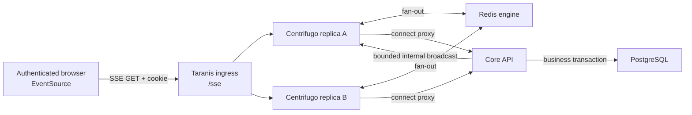

# SSE and Realtime Architecture Redesign

- Status: implemented; Redis report-lock leases deferred
- Date: 2026-07-22
- Decision owner: Taranis engineering
- Initial transport: Server-Sent Events (SSE)
- Realtime server: Centrifugo OSS 6.9.1

## Executive summary

Taranis will replace the custom `sse-broker` service with Centrifugo OSS. Phase 1 will use Centrifugo's unidirectional SSE transport for one-way notifications from core to authenticated browser clients. Centrifugo will use the Redis already present in the Taranis deployment to distribute publications across replicas.

Realtime events are deliberately lossy hints. They tell the browser that authoritative state may have changed; they do not replace REST responses, PostgreSQL state, authorization checks, or report revisions. Clients must tolerate missed, duplicate, delayed, and reordered events and recover by fetching current state.

Report locks will be separated from event delivery. Redis TTL leases will provide replica-safe advisory locks, while atomic report revision checks in PostgreSQL will prevent silent overwrites.

The phase 1 target is:

- 1,000 concurrent browser connections per Taranis deployment.
- 5 domain events per second sustained.
- Bursts of 25 domain events per second.
- Sub-second delivery under healthy operating conditions.
- No application workflow failure when realtime delivery is unavailable.

This document specifies the target design. It does not authorize or include application implementation.

## Context

The current implementation couples several unrelated concerns in `src/core/core/managers/sse_manager.py`:

- Core sends every event to a standalone Go service with a synchronous HTTP request and a 60-second timeout.
- After repeated publication errors, a process-local counter permanently stops further attempts in that core process.
- Report locks live in a process-local dictionary, so multiple core workers or replicas disagree about lock ownership.
- The broker keeps its clients and messages in memory and broadcasts every event to every authenticated connection.
- Broker replicas do not share publications and reconnecting clients cannot determine what they missed.
- The browser authentication fallback accepts JWTs in the URL query string.
- Core event types mix broad cache invalidations with report collaboration signals, but there is no audience contract.
- The frontend has no single owner for connection lifecycle, recovery, debouncing, or degraded behavior.

The current deployment already operates Redis for RQ and caching, an ingress proxy, a separate SSE container, and Kubernetes and Compose deployment definitions. The redesign should use those existing operational boundaries rather than add Kafka, NATS, or a new durable event store.

## Goals and non-goals

### Goals

- Deliver core-triggered invalidation hints to authenticated browser clients.
- Support global, organization, and user audiences without exposing data across tenants.
- Scale connections horizontally without session affinity.
- Keep core mutations successful when the realtime system is slow or unavailable.
- Provide predictable reconnect and resynchronization behavior.
- Make report locks atomic, expiring, and safe across core replicas.
- Preserve a path to richer WebSocket-based presence and collaboration without building it in phase 1.
- Provide health, metrics, logs, load limits, and graceful rollout behavior.

### Non-goals for phase 1

- Guaranteed or exactly-once event delivery.
- An offline notification inbox.
- Event sourcing, a transactional outbox, or change-data capture.
- Centrifugo history, organization/user-channel presence, join/leave events, client publishing, RPC, or dynamic subscriptions. The only presence use is server-side inspection of `global:events` for the admin connected-client status.
- Bidirectional collaboration, live cursors, or shared document operations.
- Cross-tab connection leader election.
- Using SSE payloads as authorization evidence or authoritative entity state.

## Architecture decision

### Options considered

| Option | Advantages | Disadvantages | Decision |
|---|---|---|---|
| Centrifugo OSS | Redis-backed horizontal scaling; channel routing; connect proxy; graceful shutdown; connection limits; Prometheus metrics; later WebSocket, presence, and history capabilities | Adds a product and protocol to operate; requires explicit configuration and upgrades; core retains a bounded HTTP publication call | **Selected** because richer realtime collaboration is expected within 12–18 months |
| Extend the current Go broker | Small binary; efficient connection handling; plain SSE; fully controlled by Taranis | Taranis must build and maintain Redis fan-out, audience routing, authorization, slow-client handling, metrics, graceful shutdown, and future collaboration; remains a separate repository and release | Preferred fallback only if the roadmap returns to one-way invalidations |
| Python ASGI sidecar | Same primary language and release as core; can reuse configuration conventions | Still creates a custom realtime platform; requires a separate asynchronous runtime and custom implementations of connection lifecycle, security, backpressure, and observability | Rejected |
| Stream from Flask core | No additional application service; authentication and domain state are local | Long-lived connections compete with API capacity; WSGI and multi-process fan-out are poor fits; API and connection scaling and rollouts become coupled | Rejected |
| Mercure | SSE-native protocol; standard browser API; authorized topics and recovery support | The community hub is single-node; Redis-backed clustering is part of commercial offerings | Rejected under the OSS-only baseline |
| Polling and HTMX only | Few moving parts; current REST authorization and recovery behavior | Increased backend load and update latency; weak fit for active locks and future collaboration | Retained only as degraded fallback behavior |
| WebSocket-first Centrifugo | Aligns immediately with bidirectional collaboration and the Centrifugo SDK | Adds a bidirectional protocol and SDK before phase 1 needs either | Deferred; SSE is the only phase 1 browser transport |

The decision is based on current Taranis requirements and the documented capabilities of the [current Taranis broker](https://github.com/taranis-ai/sse-broker), [Centrifugo's Redis engine](https://centrifugal.dev/docs/server/engines), [Centrifugo's unidirectional SSE transport](https://centrifugal.dev/docs/transports/uni_sse), [Centrifugo's connect proxy](https://centrifugal.dev/docs/server/proxy), and [Mercure's clustering model](https://mercure.rocks/docs/hub/cluster).

### Selected topology



Core may publish through any healthy Centrifugo replica. The Redis engine distributes that publication to every Centrifugo node that has matching subscribers. No sticky session is required.

Local Compose runs one Centrifugo instance. A production deployment that requires high availability should run at least two replicas. The horizontal-scaling integration test always uses two replicas even when the default Helm replica count remains one.

The existing Redis deployment is sufficient for the initial target. Realtime keys and channels must use a dedicated prefix. A separate Redis deployment is justified only after measurements show realtime traffic affecting RQ latency, Redis memory, or Redis CPU.

## Centrifugo baseline configuration

The first implementation will pin `centrifugo/centrifugo:v6.9.1`; it must not use `latest`. Before implementation or a later upgrade, check for security fixes within the same supported major version.

Enable only:

- Redis engine.
- Unidirectional SSE (`uni_sse`).
- HTTP server API on the cluster-internal service.
- Connect proxy authentication.
- Health endpoints.
- Prometheus metrics.

Configure `global`, `org`, and `user` channel namespaces because Centrifugo treats the text before `:` as a namespace and rejects undefined namespaces. All three use JSON-object publication validation and leave history, join/leave events, client subscribe, and client publish permissions disabled. Presence is enabled only on `global`, so core can show the admin-only connected-client status; clients receive no presence permission. The `org` and `user` namespaces leave presence disabled. The `user` namespace permits the server-assigned `user:#<user_uuid>` form; clients still cannot request that subscription themselves.

Keep disabled:

- Bidirectional WebSocket, bidirectional SSE emulation, HTTP streaming, WebTransport, and gRPC client transports.
- Client-side subscriptions and client publishing.
- Channel history and recovery.
- Client-side presence queries and join/leave publications.
- Centrifugo admin UI.
- Anonymous connections.

Use separate, randomly generated secrets for the Centrifugo HTTP API and connect proxy. Do not reuse the Taranis `API_KEY` or `JWT_SECRET_KEY`. The HTTP API must be reachable from core inside the deployment network but must not be routed through public ingress.

Set an exact origin allowlist for each deployment. Leave Centrifugo's connection limits at their defaults until production measurements justify explicit ceilings; deployment-level capacity and ingress controls remain the first operational guardrails.

Centrifugo's default 25-second heartbeat must remain more frequent than the 60-second ingress read timeout. Kubernetes termination grace remains 45 seconds, which exceeds Centrifugo's default 30-second graceful shutdown period.

## Ingress and transport

The public URL remains `${TARANIS_BASE_PATH}sse`. Ingress rewrites it to Centrifugo's `/connection/uni_sse` endpoint.

For the SSE route:

- Disable proxy response buffering and caching.
- Preserve the request `Cookie`, `Origin`, `Host`, and forwarding headers.
- Use a read timeout greater than the Centrifugo heartbeat interval.
- Do not expose Centrifugo's HTTP API, metrics, health, or admin paths through this route.
- Terminate public TLS with HTTP/2 enabled and verify it in production smoke tests.

Native SSE over HTTP/1.1 has a restrictive per-browser, per-origin connection limit, while HTTP/2 negotiates a larger stream count. Taranis opens only one EventSource per browser tab and requires HTTP/2 at the production TLS boundary. See [MDN's SSE guidance](https://developer.mozilla.org/en-US/docs/Web/API/Server-sent_events/Using_server-sent_events).

## Authentication and authorization

### Connection flow

1. An authenticated page opens a same-origin `EventSource` to `${TARANIS_BASE_PATH}sse`.
2. The browser sends the existing access-token cookie. No token is placed in a query parameter or JavaScript-readable URL.
3. Centrifugo validates the browser origin, then calls Core's protected connect-proxy endpoint and forwards the `Cookie` header.
4. Centrifugo adds `X-Realtime-Proxy-Key` through the connect proxy's `http.static_headers`; core rejects requests without the expected value. The header is not included in `http_headers` or `emulated_headers`, so a client value cannot override it.
5. Core validates the JWT cookie with the existing authentication stack and loads the current user, organization, and permissions from authoritative application state.
6. Core returns the Centrifugo user ID, connection expiry, and server-side channels. The browser cannot add channels.

The endpoint is `POST /api/realtime/connect`. Both the proxy secret and a valid access cookie are required.

A successful proxy response has this conceptual shape:

```json
{
  "result": {
    "user": "user-uuid",
    "expire_at": 1784721600,
    "channels": [
      "global:events",
      "org:organization-uuid",
      "user:#user-uuid"
    ]
  }
}
```

Core sets `expire_at` to the earlier of the JWT expiry and 15 minutes after connection. Periodic reconnect therefore re-evaluates membership without requiring presence or subscription-refresh features. Invalid authentication is returned as a non-reconnecting authentication disconnect, not as an anonymous connection.

### Channel model

Phase 1 has exactly three audience kinds:

| Audience | Channel | Use |
|---|---|---|
| Global | `global:events` | System-wide invalidations and explicit administrator broadcast notifications |
| Organization | `org:<organization_uuid>` | Shared report and lock invalidations scoped to an organization |
| User | `user:#<user_uuid>` | User-triggered task or render completion |

Client-selected channels, resource-specific channels, wildcard subscriptions, and permission-derived dynamic topics are not allowed in phase 1.

An event publisher must supply an audience explicitly. There is no default-to-global behavior. Channels route notifications but never grant data access; every subsequent REST request still performs normal RBAC checks.

Logout, user deletion, role changes, and organization changes make a best-effort call to Centrifugo's disconnect API for the affected user. Reconnection recalculates channels. A disconnect failure does not roll back the account change, but it is logged as a security-relevant warning. The 15-minute connection expiry bounds stale subscriptions. Domain events contain no confidential entity content; an explicit administrator broadcast contains only the operator-entered text intended for every connected user.

## Core publication contract

### Responsibility split

Replace the current combined manager with two independent services:

- `RealtimePublisher` creates versioned events, maps explicit audiences to channels, and calls Centrifugo.
- `ReportItemLockService` owns Redis lease operations and never manages browser connections.

Domain code calls `RealtimePublisher` only after its database transaction commits. A failed or rolled-back mutation emits no event.

### Event envelope

The domain envelope is independent of Centrifugo and is carried inside a Centrifugo publication:

```json
{
  "v": 1,
  "id": "019c8ef1-cbbc-7a9e-98e7-c1f3a5dd589f",
  "type": "report.lock.changed",
  "occurred_at": "2026-07-22T10:15:30Z",
  "resource": {
    "kind": "report_item",
    "id": "019c8ef0-b24c-74a5-824f-d3348c282b02"
  },
  "change": "updated",
  "data": {}
}
```

Required fields:

- `v`: integer schema version, initially `1`.
- `id`: UUIDv7 generated once by core.
- `type`: a known event type.
- `occurred_at`: UTC RFC 3339 timestamp.
- `change`: one of `created`, `updated`, `deleted`, `invalidated`, or `completed`.
- `data`: JSON object, empty unless a fixed publisher method adds a small value required by the event contract.

`resource` is optional. Domain publisher methods pass only opaque resource identifiers and the terminal product-render status. The admin broadcast method accepts only the validated message intended for all users. Call sites must not add report bodies, product content, usernames, email addresses, roles, permissions, access tokens, or lease tokens.

Initial event mapping:

| Event type | Normal audience | Payload behavior |
|---|---|---|
| `assess.changed` | Global | No entity body; include an ID only when it prevents an unnecessary refresh |
| `report.item.changed` | Organization | Report item ID only |
| `report.lock.changed` | Organization | Report item ID only; clients fetch current lease state |
| `product.rendered` | User | Product ID and terminal render status only; use organization audience for system-triggered renders without a user |
| `osint_source.preview.finished` | User | OSINT source ID and terminal preview status only; the matching page refetches rendered HTML |
| `notification.broadcast` | Global | Administrator-entered message up to 500 characters plus `persistent: true`; clients render the string as text until dismissed |

Consumers ignore unknown fields. An unknown `v` is not processed and triggers a full resynchronization. An unknown event `type` at a supported version is logged and ignored.

### Centrifugo HTTP call

Core sends the event to `POST /api/broadcast` through Centrifugo's cluster-internal HTTP API with the resolved channel list, `Content-Type: application/json`, and a dedicated `X-API-Key` header. The API key is never sent as a URL parameter.

Publication uses a shared connection-pooled HTTP session with:

- 200 ms connect timeout.
- 300 ms read timeout.
- No automatic retry on the business request path.
- No permanent circuit breaker.

The publisher treats non-successful HTTP responses, malformed JSON, a top-level Centrifugo `error`, or an error in any per-channel broadcast result as publication failure. It must not assume that HTTP 200 means success because Centrifugo can encode API errors in a successful HTTP response.

The total intended publication budget is 500 ms. Success or failure does not change the domain operation's response. A failure produces a rate-limited structured warning containing event ID, event type, audience kind, duration, and failure category, but no sensitive payload. Every later domain operation may attempt publication again.

This synchronous, bounded HTTP dependency is an explicit tradeoff. Redis Streams and a transactional outbox remain future options only if measurements show publication latency affecting core or product requirements change to require reliable delivery.

Remove the `broker_error` counter and the `/api/users/sse-connected` endpoint. Replace `DISABLE_SSE` with `REALTIME_ENABLED`; when disabled, `RealtimePublisher` returns without network I/O and the frontend does not create an EventSource.

## Frontend connection and recovery

A single frontend module owns the EventSource. Page modules never open their own connection.

The module:

- Opens one same-origin EventSource per authenticated browser tab.
- Parses Centrifugo's unidirectional publication envelope and checks the Taranis event version and type.
- Dispatches domain `CustomEvent` instances without embedding HTML.
- Tracks whether the connection has opened before, so a reconnect can be distinguished from the initial connection.
- Closes the connection on logout and page teardown.
- Never treats event data as trusted HTML or authorization evidence.

Page-specific handlers subscribe to relevant domain events and fetch current HTML or JSON through existing authenticated endpoints. Handlers coalesce identical refreshes for 300 ms and add 0–500 ms random jitter before broad refreshes. If an event names a resource that is not visible on the current page, the handler does nothing.

The OSINT source preview waiting fragment listens for its matching user-scoped completion event and refetches itself through HTMX. Its existing 20-second trigger remains a degraded-mode fallback because realtime publication is best-effort and the SSE transport has no history.

`notification.broadcast` is handled directly by the connection module because it does not invalidate page data. Each event creates an existing-style persistent notification, assigns the message with `textContent`, records it in the session Notification Center, and removes it only when the user dismisses it.

The dedicated Admin Notifications page also shows current connectivity. Its `ADMIN_OPERATIONS`-protected core endpoint calls Centrifugo's server API for `global:events` presence, counts client IDs and unique non-empty user IDs, and joins those IDs with Taranis users to display usernames. No username or profile data is stored in Centrifugo connection metadata, and browsers cannot call presence directly. This is a live snapshot, not a historical session or audit log.

After an established connection is lost and successfully reopens, the connection module emits `realtime:resync`. Active page handlers then fetch their authoritative state. A Centrifugo internal-disconnect response suppresses that resync because it proves no usable connection was established for that attempt and must not produce a false data-change notice. The first connection does not force every page to refetch its server-rendered content; lock-aware editor pages always fetch current lease state during initialization.

Phase 1 does not enable Centrifugo history or rely on `Last-Event-ID`. Centrifugo's unidirectional SSE protocol does not support `Last-Event-ID` because one connection may carry several channels. Recovery is always an application-level refetch.

If the connection remains unavailable for 15 seconds, show one non-blocking degraded notice: live updates are unavailable and data may require manual refresh. Retry eight times with jittered exponential backoff capped at 60 seconds, then require a page reload; a successful connection resets the retry budget. Remove the notice after a successful reconnect and resynchronization. Do not render repeated toast errors during browser retry attempts.

All ordinary read and write flows continue without realtime. An active report editor already renews its lease through REST every 30 seconds, which doubles as targeted degraded-mode lock polling. No global polling loop is added.

Remove the user-facing "Enable SSE" control. Realtime is a deployment capability rather than a user preference because disabling it silently weakens collaboration behavior.

## Report lock redesign (next PR)

> **Out of scope for PR #980:** The Redis lease, ownership-token, expiry, and lost-update protections below are intentionally deferred to the next PR. PR #980 preserves the existing process-local report-lock behavior while replacing the realtime transport.

### Lease storage

Store one lease at `taranis:report-lock:<report_item_id>` with a 90-second TTL. The value contains:

```json
{
  "owner_user_id": "user-uuid",
  "lease_token": "opaque-random-token",
  "acquired_at": "2026-07-22T10:15:30Z"
}
```

The lease token is generated by core with cryptographically secure randomness and returned only after successful acquisition. It is never logged or published.

Operations are atomic:

- Acquire uses `SET ... NX EX 90`.
- Renew uses a Redis Lua script that compares both user ID and lease token before extending the TTL to 90 seconds.
- Release uses a Redis Lua script that compares both user ID and lease token before deleting the key.

Using only the user ID is insufficient because two tabs belonging to the same user are separate editing sessions.

### HTTP behavior

Preserve the current report lock routes:

- `GET /api/analyze/report-items/<id>/locks`
- `PUT /api/analyze/report-items/<id>/lock`
- `DELETE /api/analyze/report-items/<id>/lock`

Behavior:

- An acquire `PUT` without a token creates a lease and returns the lease token, ownership, and `expires_at`.
- A renew `PUT` includes the lease token and succeeds only for the owning user and editing session.
- `DELETE` includes the lease token and succeeds only for the owning user and editing session.
- `GET` returns `locked`, `owned_by_current_user`, and `expires_at`, but never returns a lease token.
- Another owner or editing session receives `409 Conflict`.
- Redis unavailability returns `503 Service Unavailable` for lock operations.
- Report reads remain available when Redis is unavailable; the UI indicates that lock status cannot be verified.

Publish `report.lock.changed` after acquisition, release, or an ownership transition. Do not publish routine 30-second renewals. Other clients use the previously observed `expires_at` as an upper bound and fetch the lock endpoint when it expires. Automatic Redis TTL expiry does not require keyspace notifications or a cleanup worker.

### Lost-update protection

The Redis lease is advisory. It improves editor awareness but is not a correctness boundary and does not make Redis a prerequisite for saving reports.

Every user-facing report mutation includes `expected_revision`, taken from the representation the user edited. Core performs an atomic compare-and-swap in PostgreSQL: the update succeeds only when the stored revision equals `expected_revision`, and the successful transaction increments the revision.

If the revision is stale, core returns `409 Conflict` with:

```json
{
  "error": "Report changed since it was loaded",
  "current_revision": 8
}
```

The frontend preserves the user's unsaved input, fetches the current report, and asks the user to review or reapply the change. It must not silently overwrite or automatically merge arbitrary report fields.

Trusted server-side workflows that mutate reports without an interactive snapshot must lock the database row for their transaction and increment the same revision. The existing report `revision` column is reused; the redesign does not require a new database column.

## Failure behavior

| Failure | Required behavior |
|---|---|
| Centrifugo publish timeout or error | Business transaction succeeds; event is dropped; structured warning emitted; clients recover on a later event or reconnect |
| One Centrifugo replica exits | Its clients reconnect with jitter to another replica; Redis fan-out continues through healthy replicas |
| All Centrifugo replicas unavailable | REST remains operational; degraded notice appears after 15 seconds; no global polling starts |
| Redis unavailable to Centrifugo | Existing connections may remain but publications fail; readiness becomes unhealthy; core behavior matches publish failure |
| Redis unavailable to report locks | Lock operations return 503; report reads and revision-protected saves remain available |
| Browser misses or duplicates an event | Handler refetches or coalesces; final state comes from REST |
| Slow browser connection | Centrifugo's bounded client handling applies; Taranis does not add an application-level unbounded queue |
| Expired or revoked authentication | Connection is rejected or disconnected; no anonymous downgrade; normal login flow handles session expiry |
| Organization or role changes while connected | Best-effort disconnect followed by authoritative channel calculation on reconnect; no sensitive event body is exposed |
| Unsupported event schema version | Client logs once and performs a full page-specific resynchronization |

## Security requirements

- Do not place access tokens, connection tokens, API keys, or lease tokens in URLs.
- Do not share the JWT signing secret with Centrifugo; cookie validation remains in core through the connect proxy.
- Use distinct Centrifugo HTTP API and connect-proxy secrets.
- Keep Centrifugo's HTTP API, health, and metrics endpoints internal.
- Enforce exact allowed origins at Centrifugo and validate the forwarded origin in the core connect proxy.
- Treat all event payloads as untrusted input in the browser and never inject them as HTML.
- Resolve channel membership from current application state, not from client-supplied claims or channel names.
- Keep event bodies non-confidential because routing cannot replace REST authorization.
- Redact cookies, API keys, event data, and lease tokens from logs and tracing.
- Apply existing RBAC checks to lock endpoints and every refetch triggered by an event.

## Observability and operations

Enable Centrifugo's Prometheus endpoint internally and collect at least:

- Active connections by transport and node.
- Connection attempts, rejections, and rate-limit responses.
- Disconnect and reconnect rates.
- Publications and publication errors.
- Redis broker errors and latency.
- Node resource consumption and graceful-shutdown duration.

Core emits stable structured log events for realtime publish success, timeout, rejection, and connection-proxy rejection. Log-based alerts are sufficient for core in phase 1; do not add a new Python metrics dependency solely for this feature.

Alert on:

- Sustained core publication failures.
- Centrifugo readiness failure.
- Redis errors or latency affecting publications.
- A sharp reconnect-rate increase.
- A node approaching its connection ceiling.
- Repeated connect-proxy authentication or origin rejection.

Readiness requires the Centrifugo process and Redis engine to be usable. Liveness only checks that the process can respond; temporary Redis failure must not create a restart loop. Use rolling updates, readiness gates, connection jitter, and graceful termination rather than `Recreate` deployment strategy.

## Verification

### Contract and unit tests

- Construct every supported event through its fixed publisher method and check its exact channel.
- Prove fixed publisher methods include only the intended identifiers and status value.
- Prove a Centrifugo timeout, rejection, or malformed response does not change the successful domain response.
- Prove disabled realtime performs no HTTP call.
- Validate connect-proxy responses for users with and without organizations.
- Validate that only `ADMIN_OPERATIONS` users can broadcast and that input validation preserves the accepted message exactly.
- Validate that only `ADMIN_OPERATIONS` users can list connected clients, presence failures return an unavailable response, and Taranis usernames are resolved server-side.

### Authentication and isolation tests

- Reject missing, expired, malformed, and revoked cookies.
- Reject a missing or wrong proxy secret.
- Reject an unapproved or missing browser origin.
- Confirm a user receives global, their organization, and their personal channel only.
- Confirm two organizations do not receive each other's organization events.
- Confirm role, organization, logout, and deletion flows request a disconnect.

### Integration tests

Run core, Redis, ingress, and two Centrifugo replicas:

- Connect clients through both replicas and publish through each replica in turn.
- Confirm every eligible client receives the event regardless of the node holding its connection.
- Confirm ineligible clients receive nothing.
- Terminate one replica and verify clients reconnect to the other and resynchronize.
- Stop all Centrifugo replicas and verify a core mutation remains successful within the 500 ms publication budget.
- Restart Centrifugo and verify later events are delivered without replaying missed events.

### Report lock tests

- Two sessions race to acquire one report; exactly one succeeds.
- A valid owner token renews; a different user or same-user second session cannot renew or release.
- A lease expires after 90 seconds and can then be acquired by another session.
- Routine renewals do not publish lock events.
- Redis failure returns 503 for lock operations while report reads remain successful.
- Two writes with the same expected revision race; exactly one commits and the other receives 409.
- A stale revision conflict preserves submitted frontend values for user review.

### Browser tests

- One EventSource is created per authenticated tab and none when realtime is disabled.
- Centrifugo publications dispatch the correct domain event.
- A broadcast displays the exact message and remains until dismissed.
- The Admin Notifications page is a separate sidebar entry and displays the live client/user counts returned by core.
- Repeated events are debounced and irrelevant resource IDs do not refresh the page.
- A reconnect produces one resynchronization.
- A 15-second outage shows one degraded notice; recovery removes it.
- Logout closes the EventSource.
- The user-facing SSE toggle is absent.
- Lock acquisition, renewal, conflict, expiry, and revision conflict are visible without unsafe HTML insertion.

### Load and rollout tests

The acceptance load test uses two Centrifugo replicas and Redis:

- Establish 1,000 authenticated SSE connections.
- Sustain 5 events per second, then burst at 25 events per second.
- Verify eligible healthy clients receive events in under one second at the 95th percentile.
- Verify memory reaches a stable bound rather than growing with event count.
- Restart a replica and jitter reconnect attempts across at least five seconds.
- Confirm core mutation latency stays within the 500 ms realtime failure budget when publication is unavailable.

Record CPU, memory, Redis latency, event latency, reconnect rate, and error rate with the test results. These measurements, rather than speculative sharding, determine when more replicas or a dedicated Redis deployment are needed.

## Rollout and rollback

Ship core, frontend, ingress, and Centrifugo changes as one coordinated release behind `REALTIME_ENABLED`.

1. Add pinned Centrifugo environment configuration, secrets, health checks, internal API access, Redis engine configuration, and the `/sse` ingress route.
2. Deploy with `REALTIME_ENABLED=false` and validate Centrifugo health and connect-proxy authentication in the target environment.
3. Enable realtime for a test deployment and run isolation, two-replica, reconnect, and load acceptance tests.
4. Enable the new frontend connection module and core publisher together. Do not dual-publish to the old and new brokers.
5. Monitor publication failures, reconnects, Redis health, and core latency through one normal release observation period.
6. Remove the legacy `SSEManager` behavior, old broker image, obsolete endpoint, and old deployment configuration after verification.
7. Archive the standalone `sse-broker` repository only after all supported deployment manifests no longer reference it.

There is no database schema migration for the realtime transport or report revisions. Redis leases are ephemeral. Before legacy removal, rollback means disabling realtime and rolling back the coordinated application release and route configuration. After legacy removal, rollback keeps `REALTIME_ENABLED=false`; normal REST operation remains supported while Centrifugo is repaired or the previous release is restored.

## Deferred evolution

When bidirectional collaboration is approved, enable Centrifugo WebSockets and its maintained JavaScript SDK as a separate architecture change. Reuse the user identity and channel vocabulary where appropriate, but do not send collaborative editing commands through the phase 1 invalidation envelope. Presence, client publishing, document operation ordering, conflict resolution, and durable collaboration state require their own threat model and design.

Redis Streams or a PostgreSQL transactional outbox may replace direct HTTP publication only if realtime becomes a correctness requirement or observed gateway latency harms core. Centrifugo history may be enabled only for a channel whose product behavior requires bounded replay; REST resynchronization remains the default.

The custom Go broker remains the documented fallback if the collaboration roadmap is abandoned and Centrifugo's operational cost proves disproportionate. That decision must be based on production measurements, not on maintaining two realtime implementations.
